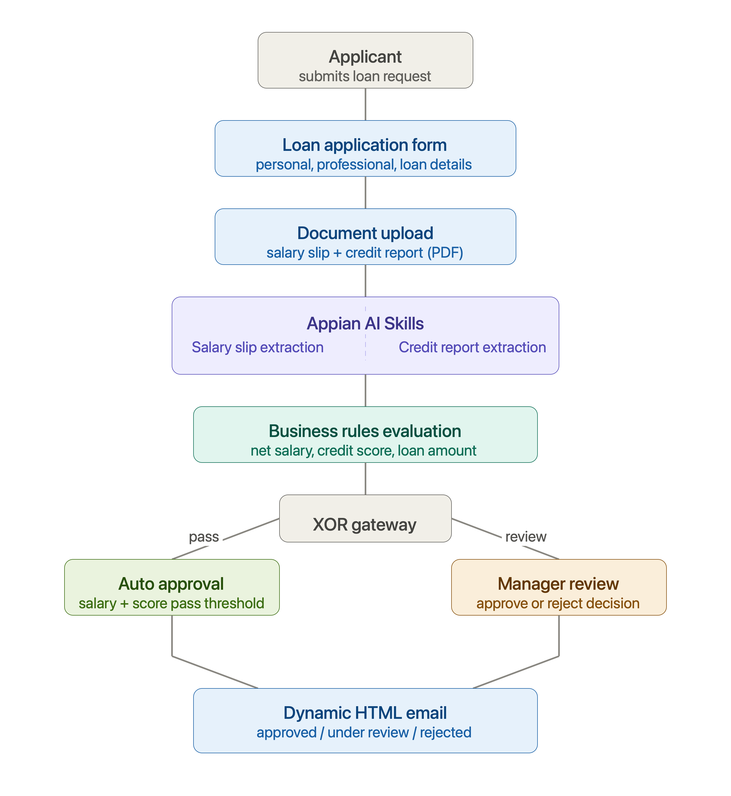
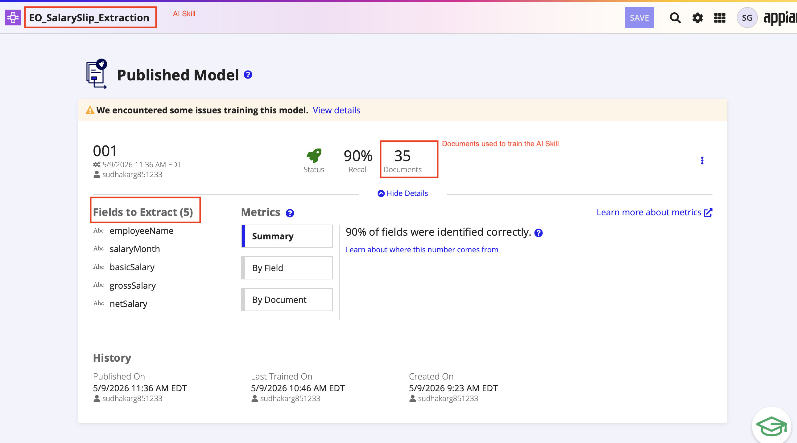

# AI-Powered Loan Approval System
### Built on Appian | AI Skills | End-to-End Workflow Automation

> 📺 **[Watch the full demo on LinkedIn](https://www.linkedin.com/posts/sudhakar-g-7a0205235_appian-appianaiskills-appiandeveloper-ugcPost-7478674638873522176-yYEk/)**

---

## Overview

What if AI could read your salary slip and credit report — and automatically decide your loan eligibility?

This POC demonstrates an end-to-end **AI-Powered Loan Approval System** built on the **Appian Low-Code Platform**, integrating Appian AI Skills for intelligent document processing with a fully automated business workflow.

What started as a simple document extraction experiment evolved into a complete enterprise-grade workflow covering application intake, AI extraction, business rule evaluation, approval routing, manager review, and dynamic email notifications.

---

## System Architecture

---

## Features

### 🤖 AI-Powered Document Extraction

**Salary Slip AI Skill** — trained on 35 documents | 90% recall accuracy

Extracts:
- Employee Name
- Salary Month
- Basic Salary
- Gross Salary
- Net Salary

**Credit Report AI Skill** — trained on 20 documents | 100% recall accuracy

Extracts:
- Credit Score

---

### ⚙️ Business Rules Evaluation

Automated loan eligibility assessed based on:
- Net Salary ≥ ₹75,000
- Credit Score ≥ 750
- Loan Amount ≤ ₹5,00,000

---

### 🔄 Workflow Automation

Two routing paths based on AI extracted data:

| Path | Condition | Outcome |
|---|---|---|
| Auto Approval | All criteria pass | Instant approval + email |
| Manager Review | Any criteria fails | Manager decision screen |

---

### 📧 Dynamic HTML Email Notifications

Four automated email types:
- Loan Approved (green)
- Under Manager Review (yellow)
- Approved After Manager Review
- Rejected After Manager Review

---

## Appian Objects Used

| Object Type | Purpose |
|---|---|
| AI Skill | Salary slip and credit report extraction |
| Process Model | End-to-end loan approval workflow |
| Interface (SAIL) | Loan application form and manager review screen |
| Expression Rules | Business logic and data transformation |
| Script Tasks | Data mapping and variable assignment |
| User Input Task | Manager review and decision |
| Send Email Smart Service | Dynamic HTML email notifications |
| XOR Gateway | Approval routing decision |
| AND Gateway | Parallel AI extraction |
| Constants | Folder references and process model links |
| Connected System | REST API integration |

---

## AI Skills — Trained Models

### Salary Slip Extraction

- Model: `EO_SalarySlip_Extraction`
- Documents trained: **35**
- Recall accuracy: **90%**
- Fields extracted: **5**

---

### Credit Report Extraction

- Model: `EO_CreditReport_Extraction`
- Documents trained: **20**
- Recall accuracy: **100%**
- Fields extracted: **1** (Credit Score)

---

## Process Model

The workflow includes:
1. **Loan Application Submitted** — start event with form
2. **AND Gateway** — parallel AI extraction
3. **Extract Salary Slip Data** — AI Skill node
4. **Extract Credit Report Data** — AI Skill node
5. **Evaluate Loan Eligibility** — XOR gateway with business rules
6. **Auto Approve Loan** — script task (pass path)
7. **Route for Manager Review** — notification + task (review path)
8. **Manager Loan Review** — user input task with decision
9. **Manager Decision** — XOR gateway (approve/reject)
10. **Send Approval / Rejection Notification** — dynamic HTML email
11. **Loan Process Completed** — end event

---

## Loan Application Form

Collects:
- Personal details (name, DOB, PAN, mobile, email)
- Professional details (employer, designation, employment type, experience)
- Loan details (amount, purpose, tenure)
- Document upload (salary slip PDF + credit report PDF)

---

## Manager Review Screen

Shows managers:
- Applicant details
- AI extracted salary and credit information
- System recommendation
- Decision dropdown (Approve / Reject)
- Comments field

---

## Email Notifications

### Auto Approved

### Under Manager Review

### Rejected After Manager Review

---

## Key Learnings

**1. local variables vs rule inputs for file upload**
File upload fields must save to `ri!` (rule inputs), not `local!` variables — local variables can't be passed as process parameters to the process model.

**2. AI extracted data comes as a Map type**
Use `index(pv!extractedData, "fieldName", "")` to access individual fields from AI extracted output.

**3. Type conversion is critical**
AI Skills return all values as Text. Use `tointeger(substitute(substitute(value, "Rs. ", ""), ",", ""))` to convert salary strings to integers for comparison.

**4. toEmailAddress() for Send Email node**
The Send Email Smart Service expects EmailAddress type — wrap process variable with `toEmailAddress(pv!emailAddress)`.

**5. Output mapping in User Input Task**
Rule inputs in task interfaces must be explicitly mapped back to process variables in the Output tab of the User Input Task node.

**6. Community Edition AI Skill performance**
AI extraction takes longer on Community Edition due to shared infrastructure. In enterprise environments this runs in seconds with dedicated processing.

---

## Tech Stack

- **Platform:** Appian Community Edition
- **AI:** Appian AI Skills — Document Extraction
- **Workflow:** Appian Process Modeler
- **UI:** Appian SAIL Interfaces
- **Email:** Send Email Smart Service with HTML templates
- **Test Documents:** Mock salary slips and CIBIL credit reports

---

## Author

**Sudhakar Galimotu**
Appian Certified Senior Developer (L2) | BPM Developer | 4 Years Experience

---

> 📌 All salary slips, credit reports, and applicant data shown are mock/sample data created for learning and demonstration purposes only.
